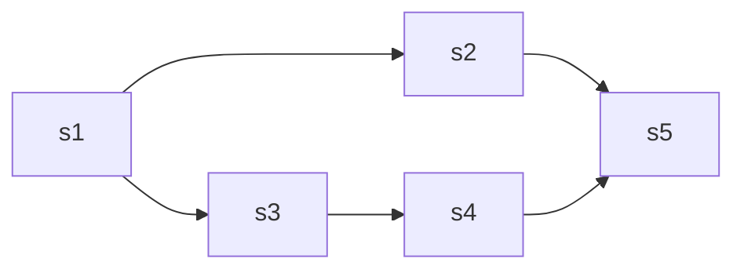
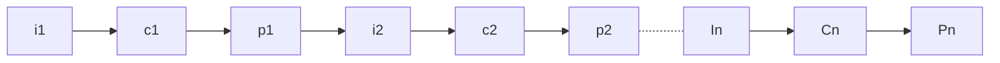

 [toc]
##### ==前驱图==
`为了描述一个程序的各个部分(程序段或者语句)间的依赖关系，或者是一个大的计算的各个子任务间的因果关系，我们常常采用前驱图的方式。前驱图式一个有向无循环图，用于描述程序，程序段或者语句执行的先后次序


---
##### ==程序的顺序执行==

`==程序的顺序执行具有如下特征==
·1.==***顺序性***==：处理机的操作严格按照程序所规定的顺序执行，只有当上一个操作完成以后，下一个操作才能开始执行。除了人为的干预造成机器暂时停顿外，前一个动作的结束就意味着后一个动作的开始
·2.==***封闭性***==：程序一旦开始运行，其执行结果不受外界因素影响。因为**==程序在运行时独占系统的全部资源==**，除了初始状态外，这些资源的状态只能由本程序改变，不受任何外界因素的影响；
·3.==***可再现性***==：只要程序执行时的初始条件和执行环境相同，当程序重复执行时，都将获得相同的结果(即程序的执行结果与时间无关)。

---
##### ==程序的并发执行==
```mermaid
graph LR;
subgraph one
 i1-->i2
 i2-->i3
 i3-.-in
 end
 subgraph two
 c1-->c2
 c2-->c3
 c3-.-cn
 end
subgraph three
 p1-->p2
 p2-->p3
 p3-.-pn
 end
 i1-->c1
 i2-->c2
 i3-->c3
 c1-->p1
 c2-->p2
 c3-->p3
 ```
 ·程序的并发执行是指若干个程序或程序段同时在系统中运行，这些程序或程序段的执行在时间上是重叠的，一个程序或程序段的执行尚未结束另一个程序或者程序段的执行已经开始。
 ·程序的并发执行虽然提高了系统的处理能力和资源利用率，但是也带来了一些新问题:
 ·==**间断性**==：程序在并发执行时，由于他们共享资源或为完成同一项任务而相互合作，使得并发程序之间形成了相互制约的关系。
 ·==**失去封闭性**==：程序在并发执行时，多个程序共享系统中的各种资源，因而这些资源状态将由多个程序来改变，致使程序的运行失去封闭性。这样的一个程序在运行时，必然会受到其他程序的影响。例如，当处理机被某个程序占用时，其他程序必须等待。
 ·==**不可再现性**==：程序并发执行时，由于失去了封闭性，也将导致失去其运行结果的可再现性。
 
---
##### ==程序并发执行的条件==
为了描述方便，先定义一些方法

$R(P_i)$={$a_1,a_2,a_3,...,a_m$},表示程序段$P_i$在执行期间所需引用的所有变量的集合，称为读集；
$W(P_i)$={$b_1,b_2,b_3,...,b_n$},表示程序段$P_i$在执行期间所需要引用的所有变量的集合，称为写集；
若两个程序段$P_1$和$P_2$能满足下述三个条件，则他们便能并发执行而且其结果具有可再现性。(***Bernstein条件***)
- $R(P_1)\bigcap W(P_2)=${}
- $R(P_2)\bigcap W(P_1)=${}
- $W(P_1)\bigcap R(P_2)=${}
·其中，前两个条件在保证两个读操作之间存储器中的数据不会发生变化；最后一个条件保证程序写操作的结果不会丢失。只要同时满足三个条件，并发执行的程序执行过程中很难对这三个条件进行检查。
---