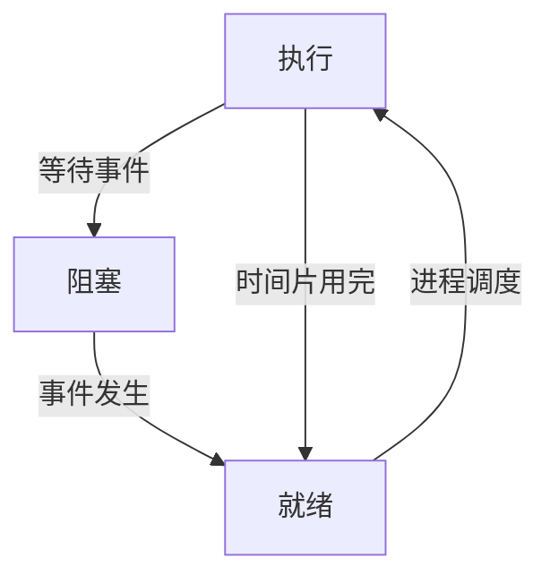
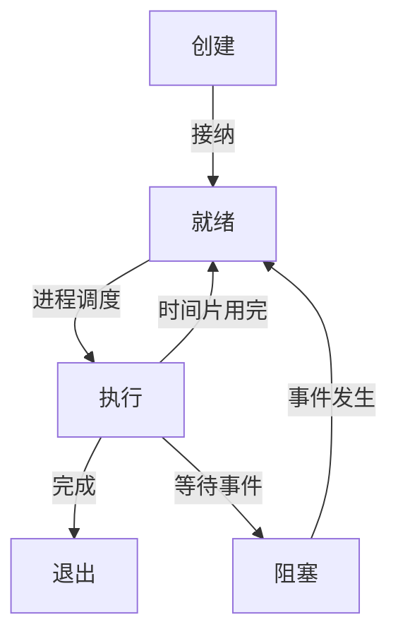
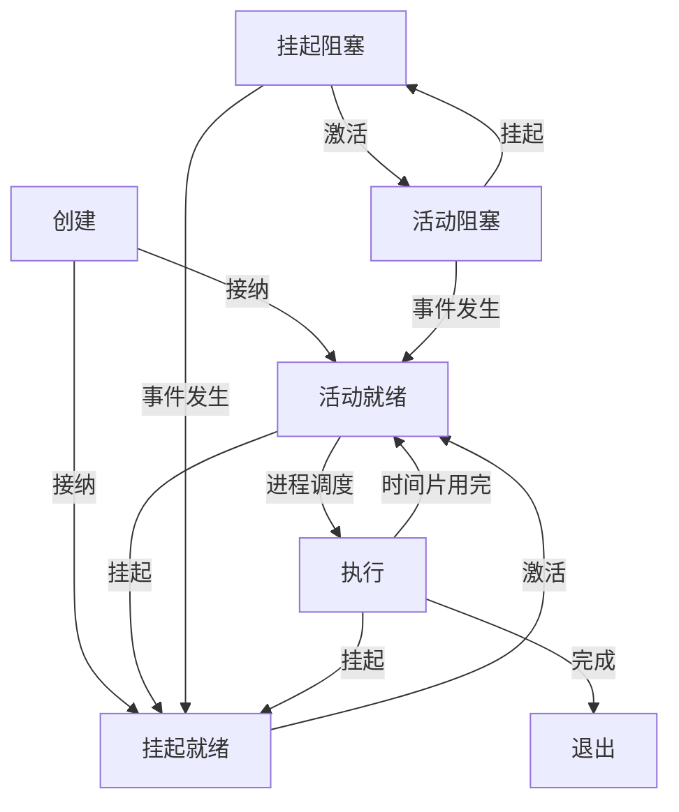

[toc]

### 进程的三种基本状态

- 通常，一个进程至少应该具有以下三种基本状态：
  - ***就绪状态***：进程已获得出处理机以外的所有资源，一旦获得处理机就可以立即执行
  - ***执行状态***：进程获得必要的资源并在处理机上执行
  - ***阻塞状态***：正在执行的过程，由于发生某事件而无法执行下去(如等待输入\输出完成)

### 进程的创建状态和退出状态

- ***创建状态***：进程刚被创建，尚未放入就绪队列
- ***退出状态***：进程已经运行结束，释放了除进程控制块之外的其他资源

### 进程的挂起状态

- 引入挂起状态可能基于以下原因
  - 系统有时可能出故障或某些功能受到损坏，这时就需要暂时将系统中的进程挂起
  - 系统中有时负荷过重(进程过多)，资源数相对不足，从而造成系统效率下降，此时需要挂起一部分进程以调整系统负荷。
  - 用户检查自己作业的中间执行情况和中间结果时，因同预期想法不符合而产生怀疑，此时用户要求挂起他的进程，以便进行某些检查和改正
  - 在操作系统中引入了虚拟存储管理技术后，需要区分进程是驻留在内存还是外存，此时可以用挂起表示进程驻留在外存。

