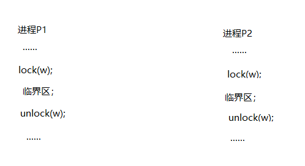
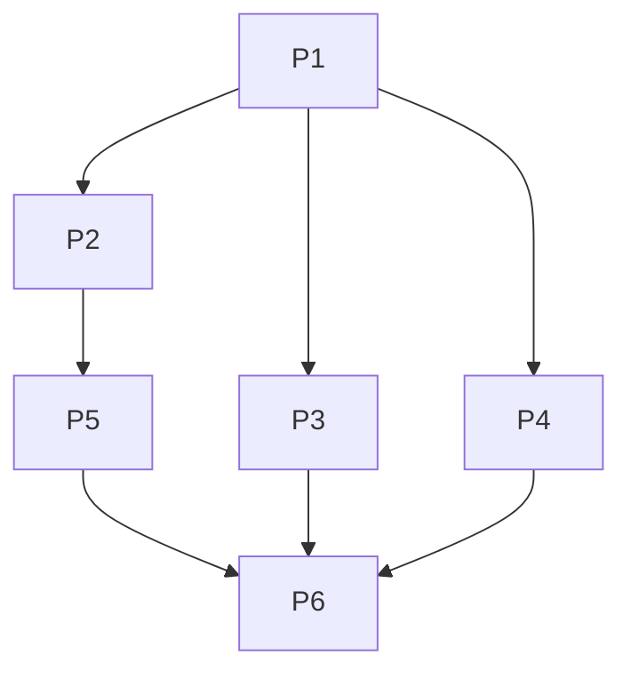
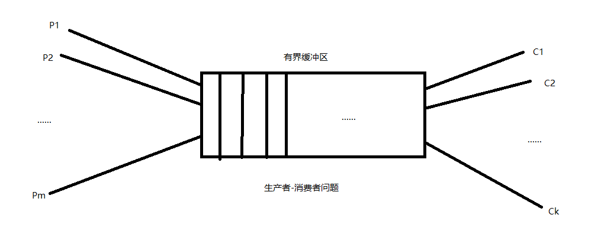
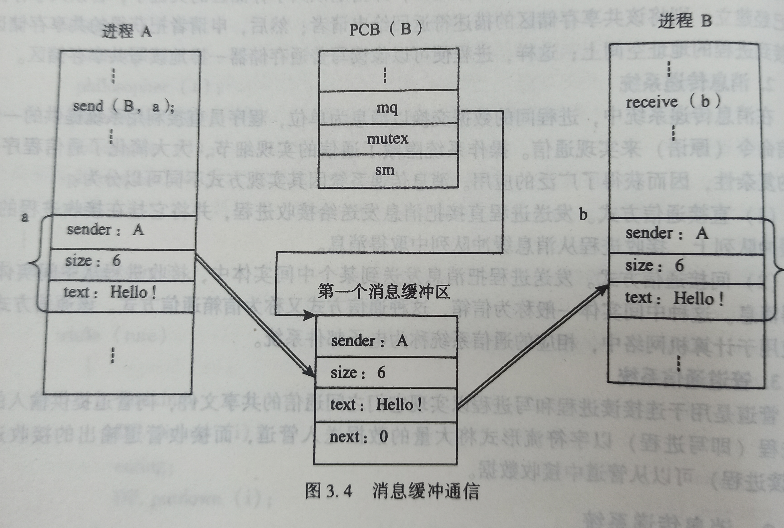

[toc]

### 临界资源与临界区

·进程在运行过程中，一般会与其他进程共享资源，而有些资源的使用具有排他性，系统中的多个进程可以共享系统中的各种资源，然而其中许多资源一次自能为一个进程使用，我们把一次只允许一个进程使用的资源称为临界资源，选多设备都属于临界资源，如打印机，绘图机等。出物理设备外，还有许多变量，数据等都可以由若干进程说共享，他们也属于临界资源，进程中访问临界资源的那段代码称为临界区，也可以称为临界段，我们将所有与同一临界资源相关的临界区称为同类临界区。

例如，有两个进程A，B,他们共享一个变量X，且两个进程按以下方式对变量X进行访问和修改：
A:    $$R_1=X;
    R_1=R_1+1;
        X=R_1;$$
B:    $R_2=X;R_2=R_2+1;X=R_2;$
其中$R_1和R_2$为处理机中的两个寄存器。这里，两个进程各自对X做了加1操作，相应的，X增加了2.如果两个进程按另一种顺序对变量进行修改：
A：$R_1=x$;
B: $R_2=x;$
A:$R_1=R_1+1;x=R_1;$
B:$R_2= R_2+1;x=R_2;$
那么，两个进程虽然都各自对变量进行了加一操作，但变量值只增加来了1；
为了防止这种错误，变量应该按临界资源处理，即让两个进程顺序使用变量
为了保证临界资源的正确使用，可以把临界资源的访问过程分成如图所示的四个部分

- 进入区：为了进入临界区使用临界资源，在进入区要检查是否可以进入临界区；如果可以进临界区，通常设置响应的“==正在访问临界区==”***标志***，以阻止其他进程同时进入临界区。
- 临界区：进程中访问临界资源的那段代码。
- 退出区：临界区后用于将“正在访问临界区”标志清除的部分
- 剩余区：进程中除进入区，临界区，退出区以外的其他部分

进入临界区的进程必须满足以下条件：

- 当有若干进程要求进入他们的临界区时，应该在有限时间内使一个进程进入临界区。
- 每次至多有一个进程进入临界区内；
- 进程在临界区内仅逗留有限的时间；

也可以将以上条件描述为：

- 空闲让进。当没有进程进入临界区时，可以允许一个请求进入临界区的进程立即进入自己的临界区
- 忙则等待。当已有进程进入临界区时，其他试图进入临界区的进程必须等待
- 有限等待。对要求访问临界资源的进程，应该保证在有限时间内进入自己的临界区
- 让权等待。当进程不能进入自己的临界区时，应该释放处理机

只有满足前三条，才能正确访问临界资源，如果还能满足第四条，则可以提高CPU的利用率

### 同步和互斥的概念

·一般来说，一个进程相对另一个进程来说的运行速度是不稳定的。也就是说，进程之间是在异步环境下运行的，每个进程都以各自独立的不接预知的速度向运行的终点推进。但是，相互合作的几个进程需要在某些确定点上协调他们的工作。一个进程到达这些点后，除非另一个进程已经完成了某些操作，否则就不得不停下来等待这些操作的结束。==多个相互合作的进程在一些关键点上可能需要相互等待或者互相交换信息，这种相互制约的关系称为进程同步==。

·互斥是由于进程共享某些资源而引起。当一个进程正在使用某些资源时，，其他希望使用该资源的进程必须等待，当该进程用完资源并释放后，才允许其他进程去访问此资源，我们称进程之间的这种关系为互斥。

### 互斥的实现方法

#### 互斥算法

- 算法1

  - 设置一个公用的整型变量***turn***，用来指示允许进入临界区的进程标识，若turn为0，则允许该进程$P_o$进入临界区；否则循环检查该变量，直到turn变为本进程的标识；在退出区，修改允许进入进程的标识turn为1,。进程 $P_1$的算法与此类似。两个进程的程序结构如下：

    - ```c
      int turn=0;
      P0{
          do{
              while(turn!=0);
              进程P0的临界区代码CS0；
              turn=1;
              进程P0的其他代码；
          }
          while(true)
      }
      P1{
          do{
              while(turn!=1);
              进程P1的临界区代码CS1；
              turn=0；
              进程P1的其他代码；    
          }
          while(true)
      }
      ```

      ·此算法可以保证两个进程互斥访问临界资源，但存在的问题是强制两个进程以交替次序进入临界区，造成资源利用不充分。
    
      
      
      算法2
      
      - 设置标志数组flag[]表示进程是否在临界区中执行，初始值均为假。在每个进程访问该临界资源之前，先检查另一个进程是否在临界区中，若不在，则修改本进程的标志为真并进入临界区，在退出去修改本进程临界区标志符为假，两进程的程序结构如下
  
  - ```java
    enum boolean{false,true};
    boolean flag[2]={false,true};
    P0:{
        do{
            while  flag[1];
            flag[0]=true;
            进程P0的临界区代码CS0；
            flag[0]=false;
            进程P0的其他代码；
        }
        while (true)
    }
    P1:{
        do{
            while flag[0];
            flag[1]=true;
            进程P1的临界区代码CS1；
             flag[1]=false;
            进程P1的其他代码；
        }
        while(true)
    }
    ```
  
    此算法解决了“空闲让进”问题，但又出现了新问题，即当两个进程都进入临界区时，它们各自的访问标志都为false，若此时的两个进程几乎同时都想进入临界区，并且发现他们的标志符都为false，则两个进程同时进入了各自的临界区，这就违背了临界区的访问规则“忙则等待”
  
- 算法3

  - 本算法任然设置标志数组flag[]，但是标志用来表示进程是否希望进入临界区，在每个进程访问临界区之前，先将知己的标志设置为真，表示进程希望自己家进入临界区，然后再检查另一个进程的标志。若另一个进程的标志为真，则进程等待；否则进入临界区。两检查的结构算法如下

    ```java
    enum boolean {false,true};
    boolean flag[2]={false,true};
    P0:{
        do{
            flag[0]=true;
            while flag[1];
            进程P0的临界区代码CS0；
            flag[0]=false;
            进程P0的其他代码；
        }
     while(true) 
    }
    P1:{
        do{
            flag[0]=true;
            while flag[1];
            进程P1的临界区代码CS1;
            flag[0]=false;
            进程P1的其他代码；
        }
        while(true)
    }
    ```

     此算法可以有效的防止两进程同时进入临界区，但是存在两个进程不能进入临界区的问题。即当两个进程几乎都想进入临界区时，它们分别将自己的标志值设置为true，并且都去检查对方的标志值，于是都进入不了临界区；

- 算法4

  - 本算法的基本思想是算法1和算法3的结合。标志数组flag[]表示进程是否希望进入或是否正在临界区中执行。此外，还设置了一个turn变量，用于指示允许进入临界区的进程标识。两进程的程序结构如下;

    ```java
    enum boolean{false,true}
    boolean flag[2];
    int turn;
    P0:{
        do{
            flag[0]=true;
            turn=1;
            while(flag[1]&&turn==1);
            进程P0的临界区代码CS0;
             flag[0]=false;
            进程P0的其他代码；
    }
        while(true)
    }
    P1:{
         do{
             flag[1]=true;
             turn=0;
             while(flag[0]&&turn==0);
             进程P0的临界区代码为CS1；
              flag[1]=false;
             进程P1的其他代码；
         }
        while(true)
    }
    ```
    
    至此，算法4可以完全正常工作。从上面的软件算法中可以看出，这些算法之所以出现问题，最主要的原因是临界资源状态和修改没有作为一个整体来实现。

### 硬件方法

完全利用软件方法实现进程互斥有很大局限性，现在已近很少单独采用软件方法。利用硬件实现进程互斥的主要思想是用一条指令完成标志的检查和修改两个操作，因而保证了检查操作与修改操作不被打断，或者通过静止中断的方式来保证一段代码作为一个整体执行。

- 禁止中断方法：==但一个进程正在处理机上执行其临界区代码时，要防止其他进程再进入他们的临界区访问，最简单的方法是禁止一切中断发生，或者称之为关中断。因为CPU只在发生中断时引起进程切换，这样禁止中断就能保证单前运行进程将临界区代码顺利的执行完，从而保证了互斥的正确实现，然后再开中断。==
  采用开关中断的方法实现进程之间的互斥即简单又高效，但这种方法也存在一些不足，如开关中断的做法限制了处理机交替执行程序的能力，因此执行的效率将会明显的降低；对于操作系统来说，当它在执行更新变量的几条指令期间将中断关掉是很方便的，但将关中断的权利交给用户进程则很不明智，若一个进程关中断之后不再开中断，则系统可能会因此终止。
  
- 硬件指令方法：许多计算机中都提供了专门的硬件指令，实现对字节内容的检查和修改或者交换两个字节内容的功能。使用这样的硬件指令就可以解决临界区互斥的问题。

  - TS(test and set)指令。该指令的功能是指读出指定标志后把该标志后把该标志设置为真。TS指令的功能可描述如下：

    ```java
    boolean TS(boolean * lock){
        boolean old;
        old=*lock;
        *lock=true;
        return old;
    }
    ```

    为了实现多个进程对临界资源的互斥访问，可以为每个资源设置一个共享布尔变量lock表示资源的两种状态：true表示正在被占用，false表示空闲，初始值为false。在进程访问临界资源以前，利用TS指令检查和修改标志lock；若有进程在临界区，则重复检查，直到其他进程退出。
    利用TS指令实现进程互斥的算法可描述为：

    ```java
    ......
    while TS(&lock);
    进程的临界区代码CS；
    lock=false;
    进程的其他代码；
    ......
    ```

    所有要访问的临界资源的进程的进入区和退出区代码都是相同的。

  - Swap指令(Exchange指令)。该指令的功能是交换两个字(字节)的内容，swap指令的功能可描述如下：

    ```java
    Swap(boolean *a,boolean *b){
        boolean temp;
        temp=*a;
        *a=*b;
        *b=temp;
    }
    ```

    利用Swap指令实现进程互斥时，应为每个临界资源设置一个共享布尔变量lock，初值为true，用于与lock交换信息，当key值为false时进程可以直接进入其临界区。每个进程进入临界区之前，利用Swap指令交换lock与key的内容，然后检查key的状态；有进程在临界区时，重复交换和检查过程，直到其他进程退出。利用Swap指令实现进程互斥的算法可以描述为：

    ```java
    ......
    key=true;
    while(key!=false);
    Swap(&lock,&key);
    进程的临界区代码CS；
    lock=false;
    进程的其他代码;
    ......
    ```

- 硬件方法的优点：

  - 适用范围广，
  - 简单
  - 支持多个临界区

#### 锁机制

· 锁机制是解决互斥的一种方案，在锁机制中通过原语保证资源状态的检查和修改作为一个整体来执行，从而能够正确的执行互斥。
  锁是一个代表资源状态的变量，通常用0表示资源可用(开锁)，用1表示资源已经被占用(关锁)。进程在使用临界资之前需要先考察锁变量的值，若果值为0，则将锁设置为1；如果值为1，则回到第一步重新考察锁变量的值，当进程使用完资源后，应该将锁设置为0 (开锁)。系统可以提供锁变量进行操作的上锁原语lock(w)和开锁原语unlock(w),其算法描述如下：

```c
lock(w){
    while(w==1);
    w=1;
}unlock(w){
    w=0;
}
```

利用上锁原语和开锁原语可以解决并发进程对临界资源访问的互斥问题，下面给出了两个并发进程$p_1,p_2$互斥使用临界资源的描述：


·“......“表示进程中的其他语

### 信号量

#### 信号量

·在操作系统中，信号量$s$表示资源的实体，他由两个成员(count,queue)构成，其中count是一个具有非初始值的整形变量，queue是一个初始状态为空的队列。整形变量count表示系统中某类资源的使用情况，当其值大于0时，表示系统中单前可用资源的数目；当其值小于0时，其绝对值表示系统中因请求该类资源等待而阻塞的进程数目。除信号量的初始值外，信号量的值仅能由P操作(wait操作)和V操作(signal操作)改变。因为这样的信号量是用记录型的数据结构描述的，所以称为记录型信号量，一般简称为信号量。
一个信号量的建立必须经过说明，即应该准确说明信号量的意义及初始值(注意这个初始值不是一个负数)。每个信号量都有一个相应的等待队列，信号量建立时该队列为空。
设$s$为一个信号量， $P(s)$执行时主要完成以下功能：先执行$s.count=s.count+1$;若$s.count>0$,则进程继续运行；若$s.count<0$,则阻塞该进程，并将它插入该信号量的等待队列中。$V(s)$执行时主要完成下述功能：先执行$s.count=s.count+1$;若$s.count>0$,则进程继续执行；若$s.count<=0$,则从该信号量等待队列中移除第一个进程，使其变为就绪状态并插入就绪队列，然后再返回原进程继续执行。上诉两个原语所执行的操作可用下面的函数描述：

```c
struct semaphore{
    int count;
    queueType queue;
                };
wait(semaphore s){
    s.count--;
    if(s.count<0){
        阻塞该进程；
        将该进程插入等待队列s.queue;
    }
}
signal(semaphore s){
    s.count++;
    if(s.count<=0){
        从等待队列s.queue取出第一个进程P：
            将P插入就绪队列；
    }
}
```

#### 利用信号量实现进程互斥

利用信号量可以方便的解决进程对临界资源的互斥访问。设$s$为实现$P_1,P_2$互斥的信号量，由于每次只允许一个进程进入临界区，所以$S$的初始值应为1(即可用资源数目为1)。只需要把临界区设置与$P(S)和V(S)$之间，即可以实现两进程对临界资源的互斥访问。互斥访问临界区的算法秒速度如下：

```c
  main(){
      semaphore s=1;
      cobegin
      P1();
      P2();
      coend
  }
P1(){
    .... //...表示剩余区
    P(s);
    进程P1的临界区；
    V(S);
    ...
}
P2(){
    ...
    P(s);
    进程P2的临界区；
    V(s);
    ...
}
```

由于信号量的初始值为1，若第一次$P$先请求使用临界资源，执行P操作使信号值减为0，则表示临界资源为空闲，可以将临界资源分配给进程$P_1,P_1$随后进入临界区执行。若此时又有第二个进程$P_2$欲进入临界区，也需要先执行P操作，这时信号量的值就减为-1，则表示临界资源已被占用，因此第二个进程$p_2$变为阻塞状态。当第一个进程$P_1$执行完临界区代码后，接着执行V操作释放该临界资源，从而使信号量值恢复到0，同时唤醒第二个进程$P_2$,待第二个进程$P_2$完成对临界资源的使用后，又执行V操作，最后使信号量值恢复到初始值1。

### 利用信号量实现前驱关系



```c
semaphore f1=0;
semaphore f2=0;
semaphore f3=0;
semaphore f4=0;
semaphore f5=0;
main(){
    cobegin
    p1();
    p2();
    p3();
    p4();
    p5();
    p6();
    coend
}
p1(){
    执行P1的程序代码；
    V(f1);
    V(f1);
    v(f1);
}
p2(){
    p(f1);
    执行P2的程序代码；
    V(f2);
}
p3(){
    p(f1);
    执行p3的程序代码；
    V(f3);
}
p4(z){
    p(f1);
    执行程序P4的程序代码；
    v(f4);
}
p5(){
    p(f2);
    执行P5的程序代码；
    V(f5);
}
p6(){
    p(f3);
    p(f4);
    p(f5);
    执行P6的程序代码；
}
```

### 经典进程同步问题

#### 生产者-消费者问题

该问题描述了一组生产者向一组消费者提供产品，他们共享一个有界缓冲区，生产者像其中投放产品，消费者从中取得产品。该问题是许多相互合作进程的一种抽象模型。例如，在输入时，输入进程是生产者，计算进程是消费者；在输出时，计算进程是生产者，打印进程值消费者。

- 我们把一个长度为N的有界缓冲区(n>0)与一群生产者进程$P_1,P_2....P_ m$和一群消费者进程$C_1,C_2......C_K$联系起来，

  如图所示。假定这些生产者和消费者是互相等效的，只要缓冲区未满，生产者就可以把产品送入缓冲区；类似的，只要缓冲区未空，消费者便可以从缓冲区中取走物品并消耗它。生产者和消费者的同步关系将禁止生产者向满缓冲区中输送产品，也禁止消费者从空缓冲区中提取产品。
  为了解决生产者-消费者这类问题，应该设置两个==同步信号量==，一个说明==空缓冲单元的数目==，用empty表示，其初始值为有界缓冲区的大小n；另一个说明==满缓冲单元的数目(即产品数目)==，用full表示，其初始值为0.在本例中，消费者和生产者要共享有界缓冲区，因此对有界缓冲区的使用就必须互斥，为此还要设置一个互斥信号量mutex，其初值为1，生产者-消费者问题的同步描述如
  
  ```c
  semaphore full=0;/*满缓冲单元的数目*/
  semaphore empty=n;/*空缓冲单元的数目*/
  semaphore mutex=1;/*对有界缓冲区进行操作的互斥信号量*/
  main(){
      cobegin
          producer();
          consumer();
      coend
  }
  producer(){
      while(true){
           生产一个产品；
          P(empty);
          P(mutex);
          将一个产品送入缓冲区；
          V(mutex);
          v(full);
      }
  }
  consumer(){
      while(true){
          P(full);
          P(mutex);
          从缓冲区中取出一个产品；
          V(mutex);
          V(empty);
          消费一个产品；
      }
  }
  ```
  
  注意：无论在生产者还是消费者进程中，P操作的次序都不能颠倒，否则将可能造成进程死锁。

#### 读者-写者问题

- 读者-写者问题是指多个进程对一个共享资源进行读写操作的问题。在读者-写者问题中，一个数据集(如文件或记录)可以被多个并发进程所共享。其中有些进程只要求读数据集的内容，而另一些进程只要求修改或写数据集的内容，这种情形在文件系统和数据集库中很常见。通常我们把只要求读数据的进程称为读进程，把要求修改数据的进程称为写进程，而把此类问题归结为读者-写者问题。
  多个读进程可以同时读此数据集，不需要互斥也不会产生任何问题，不存在破坏数据集中数据完整性和正确性的问题，但是一个写进程不能与其他进程（不管是读进程还是写进程）同时访问此数据集，他们之间必须互斥，否则将破坏此数据集的完整性。例如在一个银行管理系统中，当一个分行向总账目中写入存款数时（写者），如果结账进程（读进程）或其他的写进程同时还发生对此数据操作，就会发生错误，即数据完整性被破坏，账目是错误的，所以写操作必须互斥的进行。

- 为了实现读进程与写进程之间的同步，应该设置两个信号量和一个共享变量：读互斥变量rmutex,用于使读进程互斥的访问共享变量readcount，其初始值为1 ，写互斥信号量wmutex,用于实现写进程与读进程的的互斥以及写进程与其他的进程互斥，其初始值为1；共享变量readcount,用于记录单前正在读数据集的读进程数目，初始值0,。当一个读进程在药读取数据集时，应该将读数据计数加readcount1，如果此前(raadcount加1以前)数据集中没有读进程，则还应对互斥信号量wmutex做P操作,这样，若数据集中无写进程，则通过P操作阻止后续写进程写；若数据集中有写进程，则通过P操作让读进程等待，同理，当一个读进程完成读数据集的操作时，应该将读进程数据计数readcount减少1,；如果此时数据集中已无读进程，则还应该对写互斥信号量wmutex做V操作，以允许写进程写。读者-写者问题的同步算法可以描述如下：

  ```c
   semaphore rmutex=1;
   semaphore wmutex=1;
   int readcount=0;
  main(){
      cobegin
          read();
          writer();
      coend
  }
  read(){
      while(true){
          P(rmutex)
              if(readcount==0)
                  P(wmutex);/*当第一个读进程读数据集时，阻止写进程写*/
          readcount ++;
          V(rmutex);
          读数据集；
          P(rmutex);
          readcount --;
          if(readcount ==0)
              V(wmutex);
          //当最后一个读进程读完数据集时，允许写进程写
          V(rmutex);
      }
  }
  writer(){
      while(true){
          P(wmutex)
              写数据集；
          V(wmutex);
      }
  }
  ```

  !@==rmutex==是一个互斥信号量，用于使读进程互斥的访问共享变量readcount，该信号量并不表示读进程的数目，表示读进程的数目的是共享变量readcount。
  在上面的解法中，读者是优先的，即当读者存在时，写操作将被延迟，并且只要有一个读者活跃，随后而来的读者都将被允许访问文件，从而，导致了写进程长时间等待。增加信号量并修改上诉算法可以得到写进程具有优先权的解决方案，保证当一个写进程声明想写时，已经开始读的进程，就让他们读完，但不允许新的读进程在访问数据集。

#### 哲学家进餐问题

·此问题描述的是五个哲学家，他们的生活方式是交替的进行思考和进餐。哲学家们共用一张圆桌，分别坐在桌子周围的五张椅子上，在圆桌上有五个碗和五双筷子，平时哲学家们只进行思考，饥饿时便试图取用其左右最靠近他的筷子，只有拿到了两只筷子时，哲学家才能进餐。进餐完毕，有放下筷子开始思考。哲学家进餐问题也许并不重要，但可以将此问题看做并发进程执行时处理共享资源的一个有代表性的问题。
为了解决哲学家进餐问题，可以用一个信号量表示一只筷子，由这五个信号量构成信号数组：semaphore stick[5];所有信号量初值为1，第i个哲学家的活动算法可以描述如下：

```c
semaphore stick[5]={1,1,1,1,1};
main(){
    cobegin
        philosopher(0);
        philosopher(1);
        philosopher(2);
        philosopher(3);
        philosopher(4);
    coend;
}
philosopher(int i){
    while(true){
        思考；
        P(stick[i]);
        P(stick[(i+1)%5]);
        进餐;
        V(stick[i]);
        v(stick[(i+1)%5]);
    }
}
```

上述算法可以保证不会有相连的两个哲学家同时进餐，但有可能引起死锁，如果哲学家几乎同时饥饿并各自拿起了左边的筷子，这使得五个筷子的信号量均为0，当他们试图拿起右筷子时，都将因为无筷子拿而无线等待下去。
为了防止死锁发生，可以对哲学家进餐施加一些限制条件。如至多允许四个哲学家同时进餐；仅当一个哲学家左右两边的筷子都可以用时才允许他抓起筷子；将所有的哲学家顺序编号，要求奇数号哲学家先抓起他的左筷子，然后再抓起他的右筷子，而要求偶数号哲学家先抓起他的右筷子，然后再抓起他的左筷子。

#### 睡眠理发师问题

该问题描述的是，理发店里有以为理发师，一把理发椅和N(N>0)把供等候理发的顾客的椅子。如果没有顾客，则理发师便在理发椅上睡眠；当一个顾客来到时，他必须叫醒理发师，当理发师正在理发时，又有顾客来到，那么，如果有空椅子可以坐，则顾客就坐下来等候，否则就可以离开理发店。
为了解决睡眠理发师问题，设置两个进程：顾客进程和理发师进程。理发师开始工作时，先看一看店内有无顾客，如果没有顾客，则他就在理发椅上睡眠，如果有顾客，则他就为等待时间最久的顾客服务，且等待人数-1，每位顾客在进程开始执行时，先看看店内有无空座位，如果没空座位，就不等候了，离开理发店，如果有空座位，则排队等候理发，等待人数加1，如果理发师在睡眠，则唤醒他工作，为此算法引入了三个信号量个一个 共享变量：
信号量customers用来记录等候理发的顾客数(不包括正在理发的顾客)，初值为0
信号量barbers用来记录正在等候顾客的理发师数，初值为0
信号量mutex用来互斥访问共享变量waitting，初值为1
共享变量waitting用来记录等候理发的顾客数，初值为0,。变量waitting是customers信号量值的一个副本，因为同步描述中需要判断等候的顾客人数，而信号量上只能进行P,V操作，所以设置waitting来跟踪customers的值

```c
semaphore customers=0;
semaphore barbers=0;
semaphore mutex=1;
int waitting=0;
main(){
    cobegin
        barber();
        customer();
    coend
}
barber(){
    while(true){
        P(customers);//若无顾客，理发师睡眠
        P(mutex);
        waitting-=1;
        V(barbers);//理发师准备为一个顾客理发
        v(muetx);
        cut-hair();
    }
}
customer(){
    P(mutex)
    if(waitting<N){
        waitting-=1;
        V(customers);
        v(mutex);
        P(barbers);//理发师忙，顾客等待
        get-hair-cut();
    }
    else V(mutex);//人满离开
}
```


### 信号量集机制

利用信号量机制可以很好的解决单个资源的互斥访问，当需要同时控制多个进程资源的互斥访问时，利用前面的记录型信号量机制容易出现死锁，为此又引入了集合型的信号量机制。信号量集机制是指同时需要多个资源的信号量操作。

- AND型信号量集机制

  在有些场合，一个进程需要先获得两个或者更多的共享资源，方能执行其任务，假定现场有两个进程A和B，他们都要求访问共享数据D和E，当然共享数据都应该作为临界资源。

  Process A:    P(S_D);    P(S_E);

  Process B:    P(S_E);    P(S-D);

  若进程A和B按照下面次序交替执行P操作：

  Process A:    P(S_D);    于是S_D=0

  Process B:    P(s_E);    于是S_E=0
  Process A:    P(S_E);    于是S_E=-1,A阻塞
  Process B:    P(S_D);     于是S_D=-1,B阻塞
  最后，两个进程A和B都处在阻塞状态，若无外力作用，则两者都无法从阻塞状态中解脱出来，我们称此时进程A和B进入死锁状态。
  将进程在整个运行过程中需要的所有临界资源，一次性地全部分配给进程，待该进程使用完后再一起释放。只要尚有一个资源未能分配给该进程，其他所有可能为之分配的资源，也不在分配给它，这就是AND同步机制的基本思想。为此，在P操作中增加一个“AND”操作，故称为AND同步，或者称为同时P(操作)。我们用SP和SV表示相应的原语操作。SP和SV操作的定义如下：

  $SP(S_1,S_2,S_3,...,S_n)${

  if($S_1>=1$&&...&&$S_n>=1$)

  #####     for{i=1;i<=n;i++}    $S_i=S_i-1$;

  else
      *place the process in the  waiting queue associated with the first $S_i$ found with $S_i<1$,and set the program count of this process to the beginning of Swait opetation* . 

  };

  $SV(S_1,S_2,S_3,...,S_n)${

  for(i=1;i<=n;i++){

  $S_i=S_i+1$;

  *Remove all the process waiting in the queue associated with $S_i$ into the ready queue.*

  }};

  

  ---

  - 一般信号量集机制

    一般“信号量集”是指同时需要申请多种资源、每种资源申请数目不同，且可分配的资源还存在一个临界值的信号量机制。由于一次需要申请n个某类资源。因此如果通过n次P操作申请这n个资源，则操作效率很低。并且可能出现死锁。一般信号量集的基本思路就是在AND型信号量集的基础上进行扩充，在一次原语操作中完成所有的资源申请。假设信号量$s_i$的临界值为$t_i$(表示信号量的判断条件，若$S_i<t_i$，即当资源数低于$t_i$时,便不予分配)，资源申请量为$d_i$,用==SP==和==SV==表示相应的原语操作，其定义如下：$$SP(S_1,t_1,d_1,...,S_n,t_n,d_n)$${

    ```c
    if(S1>=t1&&S1>=d1&&...&&Sn>=tn&&Sn>=dn){
        for(i=1;i<=n;i++)
            Si=Si-di;
    else 
        Please the process in the waiting queue associated with the first Si found with Si<1,and set the program count of this process to be beginning of the Swait operation.};
    ```

    };

  ​      $$SV(S_1,D_1,...,S_n,d_n)$${

  ```c
  for(i=1;i<=n;i++){
      Si=Si+di;
      Remove all the process waiting in the queue assoicated with Si into the ready queue.
  }
  ```

  };

  一般信号量集可以用于各种情况资源的分配和释放。下面是一般信号量集的几种特殊情况：

  1. $SP(S,d,d)$:此信号量集中只有一个信号量$S$,但允许每次申请d 个资源，当资源数嫂鱼$d$个时便不予分配
  2. $SP(S,1,1)$;此信号量集已退化为记录型信号量，单$S=1$时表示互斥信号量。
  3. $SP(S,1,0)$;这是信号量集的一种很特殊情况，可作为一个可控开关。单$S>=1$时，允许多个进程进入某特定区域；当$S=0$时禁止任何进程进入某特定区域。


### 管程

​	用信号量机制可以实现进程之间的同步个互斥，但由于信号量的控制信息发布在整个程序中，其正确性分析很苦难，使用不当还可能导致进程死锁。

#### 管程的定义

· 管程定义了一个数据结构和能为并发进程所执行的一组操作，这组操作能同步进程个改变管程中的数据。由管程的定义可知，管程由局部于管理的共享数据结构说明、对这些数据结构进行操作的一组过程以及对这些数据结构设置初始值的语句组成。管程的语法描述如下：

```c
Monior omnitor_name;//管程名
variable declarations;//共享变量说明
P1(){...}
P2(){...}
Pn(){...}{
    initialization code;//设初值语句
}
```

==管程具有以下基本特征==：

- 局部于管程的数据只能被局部于管程内的进程所访问

- 一个进程只有通过调用管程内的过程才能进入管程内访问共享数据

- 每次仅允许一个进程在管程内执行某个内部过程。即进程互斥的通过调用内部过程进入管程，其他想进入内部管程的进程必须在等待队列中等待。

  为实现进程间的同步，管程还必须包含若干用于同步的设施。例如，一个进程调用管程内的过程而进入管程，在该过程执行期间，若进程要求的某共享资源目前没有，则必须将进程阻塞，于是必须有使进程阻塞并且使他离开管程以便其他进程可以进入管程执行的设施；类似的，在以后的某个时候，当被阻塞进程等待的条件得到满足时，必须使阻塞进程恢复运行，允许他重新进入管程并从断点(阻塞点)开始执行。因此在管程定义中还应包含以下一些支持同步的设施：

  1. 局限于管程并只能从管程内进行访问的若干条件变量，用于区别各种不同的等待原因。
  2. 在条件变量上进行操作的两个函数过程Cwait和Csignal。Cwait(c)将调用此函数的进程阻塞在与该条件变量相关的队列中，并使管程成为可用，即允许其他进程进入管程，Csignal(c)唤醒在该条件变量上阻塞的进程，如果有多个这样的进程，则选择其中的一个进程唤醒；如果该条件变量上没有阻塞进程，则说什么也不做。

- ==用管程实现生产者-消费者问题==

​    管程模块PC控制着用于保存和取出字符的缓冲区，缓冲区大小为N。管程中有两个条件变量：当缓冲区中至少有增加一个字符的空间时，notfull为真；当缓冲区中至少有一个字符时，notempty为真。描述如下

```c
monitor PC;
char buffer[N];
int nextin,nextout;
int count;
condition notfull,notempty;
append(char x){
    if(count==N)
        Cwait(notfull);
    buffer[nextin]=x;
    nextin=(nextin+1)%N;
    count++;
    Csignal(notempty);
}
take(char x){
    if(count==0)
        Cwait(notefull);
    x=buffer[nextout];
    nextout=(nextout+1)%N;
    count--;
    Csignal(notfull);
}
{
    count=0;
    nextin=0;
    nextout=0;
}
/*利用上面定义的管程，可以实现生产者-消费者问题，其算法描述如下*/
main(){
    cobegin
        producer();
        consumer();
    coend
}
producer(){
    char x;
    while(true){
        producer(x);
        append(x);
    }
}
void consumer(){
    char x;
    while(true){
        take(x);
        consume(x);
    }
}
```

生产者可以通过管程中的过程append往缓冲区中增加字符，该过程先检查条件notefull，以确定缓冲区是否还有可用空间，如果没有，这执行管程的进程在这个条件上被阻塞。当缓冲区不在满时，阻塞进程可以从队列中移出，并恢复处理，在往缓冲区中设置了一个字符后，该进程发送notefull条件符号。对消费者的描述与此类似。
从这个例子可以看出，与信号量相比，管程担负的责任不同，对于管程而言，它本身实现了互斥，使生产者 和消费者不能同时访问缓冲区；程序员只需要把适当的Cwait和Csignal原语放在管程中，便可以防止进程往一个满缓冲区中存放产品，或者从一个缓冲区中取出产品。而使用信号量时，互斥和同时都属于程序员的责任。

- 用管程实现哲学家进餐问题

  为了利用管程来解决哲学家进餐问题，我们首先定义了哲学家在不同时刻所处的状态：进餐，饥饿和思考。为此，我们引入了以下数组表示哲学家的状态：

  ```c
  enum{thinking,hungry,eating}state[5];
  ```

  哲学家$i$能建立状态state[$i$]=eating,仅当他的两个邻座便不再进餐时，即state[($i-1$)%5]!=eating,以及state[($i+1$)%5]!=eating.

  另外，还要为每个哲学家设置一个条件变量：

  condition self[5];
  当哲学家$i$饥饿但又不能获得两支筷子时，进入其条件变量等待队列。
  在上述两个数组的基础上，管程中还设置了三个函数：

  1. pickup(i)(外部函数)。哲学家可以调用该函数拿起拿起筷子进餐
  2. putdown(i)(外部函数)哲学家进餐完毕，可以调用该函数放下筷子，通知临近哲学家进餐。
  3. test(i)(内部函数)。该函数是测试函数，用于测试哲学家是否具备进餐条件。它只能被管程中的函数pickup(i)和putdown(i)调用，不能被该进程直接调用，所以称为内部函数。

  ```c
  monitor DP;
  //管程DP的描述
  enum{thinking,hungry,eating}state[5];
  condition self[5];
  pickup(int i){
      state[i]=hungry;
      test(i);
      if state[i]!=eating Cwait(self[i]);
  }
  putdown(int i){
      state[i]=thinking;
      test((i+4)%5);
      test((i+1)%5);
  }
  test(int k){
      if(state[(k+4)%5]!=eating&&(state[k]==hungry)&&(state[(k+1)%5]!=eating){
          state[k]=eating;
          Csignal(self[k]);
      }
  }
         {
      for(i=0;i<=4;i++)
             state [i]=thinking;
  }
         //利用上面定义的管程，可以实现哲学家进餐问题，描述如下
         main(){
             cobegin
                 philosopher(0);
                 philosopher(1);
                 philosopher(2);
                 philosopher(3);
                 philosopher(4);
             coend
         }
   philosopher(int i)
         {
           while(true){
               thinking;
               DP.pickup(i);
               eating;
               DP.putdown(i);
           }
         }
  ```

  ### 进程通信

  ·当进程之间需要进行数据的传输，资源的共享，事件的通知，进程的同步时，就需要进行信息交换。进程之间的这种信息交换就是进程通信。

  #### 进程通信的类型

  1. 共享存储器系统：

     在共享存储器系统中，进程通过共享内存中的内存去来实现通信。

  2. 消息传递系统

     在消息传递系统中，进程间的数据交换以消息为单位，程序员直接利用系统中提供的一组通信命令 (原语)来实现通信。操作系统隐藏了通信的实现细节，大大简化了通信程序编制的复杂性，因而获得了广泛的应用。消息传递系统因其实现方式不同可以分为

     - 直接通信方式。发送进程直接把消息发送给接受进程，并把他挂在接收进程的消息缓冲队列上，接收进程从消息缓冲队列中取得消息。
- 间接通信方式。发送进程把消息发送到某个中间实体中，接受进程从中间实体取得消息，这种中间实体一般称为信箱，这种通信方式又称为信箱通信方式，这种通信方式广泛应用于计算机网络中，相应的通信系统称为电子邮件系统。
  
3. 管道通信系统。管道是用于连接读进程和写进程之间以实现他们之间的共享文件，向管道提供输入的发送进程(即写进程)以字符形式将大量的数据送入管道，而接收管道输出的进程(即读进程)可以从管道中接收数据。

#### 消息传递系统

##### 消息缓冲通信

消息传递系统是实现进程通信的常用方式，这种通信方式既可以实现进程间的信息交换，也可以实现进程间的同步。

1. 消息缓冲通信
  
     所谓消息是指一组信息，消息缓冲区是含有如下信息的缓冲区
  
     - 指向发送进程的指针sender
     - 指向下一个消息缓冲区的指针next
     - 消息长度size
     - 消息正文text
      
     
     消息缓冲区是进程通信的一个基本单位，每当发送进程想要发送消息时，便形成一个消息缓冲区，再发送给指定的接受进程。因为接受进程可能会收到多个进程发来的消息，故应该将所有的消息缓冲区链接成一个队列，该队列的头指针可以存放在接受进程的PCB中，为了表示队列中消息的数目，还可以在PCB中设置一个表会死消息数目的信号量，每当发送进程发来一个消息并将该消息挂在接收进程的消息队列上时，便在消息数目信号量上执行V操作，而当接收进程从消息队列读取一个消息时，先对消息数目信号量执行P操作，再从队列上移出要读取的消息。另外，消息队列属于临界资源，因此还应该在PCB中设置一个用于互斥的信号量。为了描述方便，假设消息队列头指针为mq，消息数目信号量为sm，互斥读取消息的信号量为mutex。
    发送进程在发送消息前，先在自己的内存空间设置一个发送区，把待发送的消息填入其中，然后再用发送原语将其发送出去。接受进程则在接受消息之前，在自己的内存空间中设置相应的接收区，然后用接收原语接收消息。两个进程进行通信的过程如图所示。

  发送原语的功能是那待发送消息从发送区复制到消息缓冲区，并将他挂在接收进程的消息队列末尾。如果接收进程因等待消息而处于阻塞状态，则将其唤醒。其工作流程如下
     
     ```c
     Send(receiver,a)//receiver为接受者标识号，a为发送区首地址
     {
         向系统申请一个消息缓冲区；
         向发送区消息送入新申请的消息缓冲区；
         P(mutex);
         把消息缓冲区挂入接收进程的消息队列
         V(mutex);
         V(sm);
     }
  ```
     
  接收原语的功能把消息缓冲区复制到接收区，然后将消息缓冲区从消息队列中移出，如果没有消息可以获取，则进入阻塞状态。其工作流程如下：
     
     ```c
     Receive(sender,b)//sender为发送者标识号，b为接收区首地址
     {
         P(sm);
         P(mutex);
         从消息队列中找到要接收的消息；
         从消息队列中摘下此消息；
         V(mutex);
         将消息复制到接收区；
         释放消息缓冲区；
     }
  ```

  2. 信箱通信
  
     信箱通信是一种间接进程通信方式。信箱是一种数据结构，其中存放信件。当一个进程(发送进程)要与另一个进程(接收进程)通信时，可由发送进程创建一个链接两进程的信箱，通信时发送进程只需要把待发送信件投入信箱，接收进程就可以在任何时候取走信件，不存在信件丢失的可能。
     信箱逻辑上可以分为信箱头个信箱体两部分。信箱头中存放有关信箱的描述，信箱体由若干格子组成，每格存放一个信件，格子的数目和大小在创建信箱时确定。信件的传递可以是单向的，也可以是双向的。
     在单向信箱通信方式中，只要信箱中有空格，发送进程便可以向信箱中投递信件，若所有格子都以及装满，则发送进程等待或者继续执行，待有空格子时再发送，类似的，只要格子中装有信件，接收进程便能取出一个信件，若 信箱为空，则接收进程等待或者继续执行。
     在双向通信方式中，信箱中即有发送进程发出的信件，也有接收进程的回答信件。由于发送进程个接收进程是以各自独立速度向前推进的，当发送进程发送信件的速度超过接收进程的接收速度时，就会产生上溢(信箱满)；反之，则虎产生下溢(即接收进程向空信箱索取信件)。这就需要在两个进程之间进行同步控制，当信箱满时发送进程应该等待，直到信箱有空格子时再发送；对接收进程，当信箱空时，它也应等待，直到信箱中有信件时再接收。
     信箱通信方式中也使用原语操作，如创建信箱原语，撤销信箱原语，发送与接收原语等。另外，在许多时候，存在着多个发送进程和多个接收进程共享信箱的情况。
     
  3. 消息通信中的同步问题
     进程间的消息通信隐含着某种同步关系，如只有当一个进程发送出消息之后，接收进程才能接收消息。对于一个发送进程来说，它在执行发送原语后(即发送完消息后)，有两种可能选择：

     - 发送阻塞进程，直到这个消息被接收进程接收到，这种发送称为阻塞发送。
     - 发送进程不阻塞，继续执行，这种发送称为非阻塞发送。

     同时，对于一个接收进程来说，在执行接收原语后，也有两种可能选择：

     - 如果一个消息在接受原语执行之前已经发送，则该消息被接收进程接收，接收进程继续执行。

     - 如果没有正在等待的消息，则该进程阻塞直到有消息到达；或该进程继续执行，放弃接收的努力。前者称为阻塞接收，后者称为非阻塞接收。

       因此，发送进程和接收进程都可以阻塞方式或者非阻塞方式工作。根据发送进程和接收进程采取的方式不同，通常有三种常用的组合方式，但对于一个特定的系统来说只会实现其中的一种或者两种组合方式。

       1. 非阻塞发送。阻塞接收。这是最常用，最自然的方式。这种非阻塞发送的方式便于发送进程尽快地向多个进程发送一个或多个消息，同时这种非阻塞发送也适合客户进程在提出输出请求后继续向前执行，不需要阻塞等待打印请求的完成，这种阻塞接收的方式也特别适用于那些不等待消息到来就无法进行后续工作的进程，如等待服务请求到来服务器进程和等待资源(硬资源和软资源)的进程的工作情况。但非阻塞发送的方式也存在隐患。他可能导致有意或者因为错误造成发送进程反复不断地发送消息，造成大量资源的浪费。
       2. 非阻塞发送，非阻塞接收。这是分布式系统常用的通信方式，因为采用阻塞接收方法时，如果发送来的消息丢失(这在分布式系统中常发生),或者接收进程所期待的消息未发送之前，发送进程就发生问题了，那么阻塞接收方式将导致接收进程无期限被阻塞。而改进的办法就是使用非阻塞接收方式，即接收进程在接受消息时，若有消息，就处理消息；若没有消息，就继续执行，放弃接收的努力。
       3. 阻塞发送，阻塞接收。发送进程在发送完消息后，阻塞进程自己等待接收进程发送回答消息后才能继续执行。接收进程在接受到消息前，也阻塞等待，直到接收消息后才能继续向前执行。接收进程在接收到消息前，也阻塞等待，直到接收到消息后再向发送进程发送一个回答消息。
