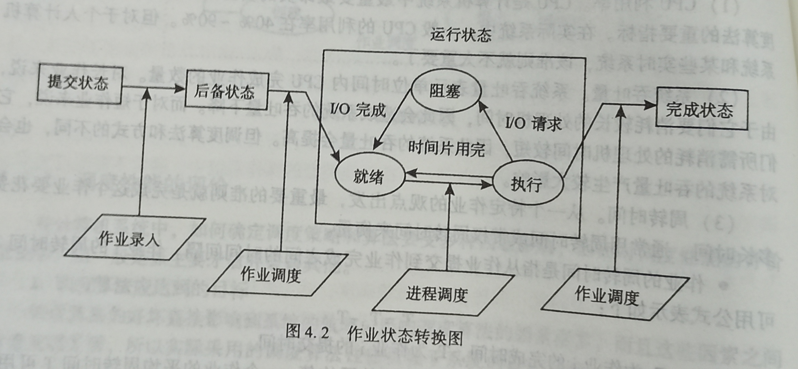

[toc]
### 作业调度
#### 作业的状态以及转换
·一个作业从进入系统到运行结束，一般需要经历提交、收容、运行、完成四个阶段，这四个阶段相对应的作业处于提交、后备、运行、完成四个阶段。与这四个阶段相对应的作业处于提交，后备，运行个完成四个状态。作业的状态及其特征转换可以用下图表示

1. ==提交状态==：
    用户为了上机解题或某项事物处理，必须事先准备好自己的作业。然后将作业通过纸带输入机或键盘输入设备提交给计算机系统。用户作业由输入设备向系统外存输入时所处的状态称为提交状态
2. ==后备状态==
    当一个作业通过输入设备进入计算机，并由操作系统将其存放在磁盘中以后，系统为这个作业建立一个作业控制块，并将它插入到后备作业中等待调度运行。此时，这个作业的状态称为后台状态。从作业输入开始到放入后备作业队列这一过程称为收容阶段，也称为作业注册。
3. ==运行状态==
    当作业调度程序选中一个作业，为它分配了必要的资源并建立了相应的进程之后，这个作业就由后备状态变为运行状态。
    处于运行状态的作业在系统中并不一定真正占有处理机，他可能被进程调度程序选中而得到处理机，正在处理机上执行；也可能正在等待某事件的发生；还有可能在等待着进程调度程序为其分配处理机。
4. ==处理状态==
    当作业正常运行结束或因为发生错误而终止运行时，作业就处于完成状态。此时，由操作系统将作业控制块从当前作业队列中删去，并回收其所占用的资源，将作业运行结果存入输出文件并调用有关输出设备进行输出。
#### 作业调度
·作业调度的主要功能是按照某种原则从后备作业队列中选取作业进入内存，并为作业做好运行前的准备工作和作业完成后的善后处理工作，完成这种功能的程序称为作业调度程序。
1. 作业调度程序的功能
·作业调度程序主要完成以下工作：
- 记录进入系统的各个作业情况。
- 从后备作业中挑选一些作业投入执行。
- 为被选中的作业做好执行前的准备工作。作业调度程序让一个作业从后备状态进入运行状态之前，必须为该作业建立相应的进程，分配其运行需要的资源，分配的资源包括内存，磁盘空间和外设等。
- 在作业运行结束或运行过程中因为某种原因需要撤离时，作业调度程序还需要完成作业的善后处理工作。
2. 作业控制块
在外存中往往有许多作业，为了管理和调度这些作业，就必须记录已进入系统中的各作业的情况。如同进程管理一样，系统为每个作业设置一个作业控制块JCB，其中记录了作业的有关信息。
通常作业控制块中包括的内容有：
- 资源要求。资源要求是指作业运行需要的资源情况，包括估计运行时间、最迟完成时间·需要的内存容量、外设类型及数量等
- 资源使用情况。资源使用情况包括作业进入系统的时间、开始运行的时间、已运行时间、内存地址、外设台号等。
- 作业的控制方式，类型和优先级等。作业的控制方式有联机作业控制和脱机作业控制，前者又称为直接控制，后者又称为自动控制。
- 作业名，作业状态。记录作业的标识信息及作业的当前状态。
